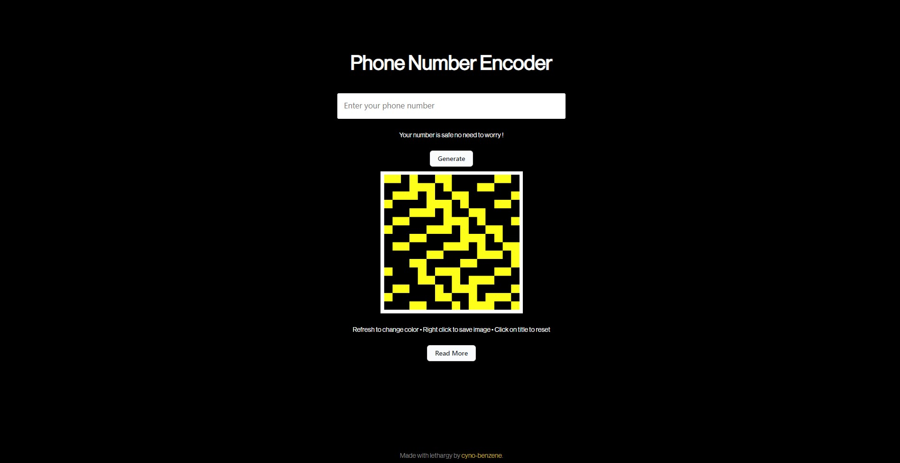

# Phone Number Encoder



The tool just converts phone number to PNG images that be used as a colorful way to share numbers easily. The idea is to have a way to share phone numbers just like QR codes. Rather the image leaves an abstract and unique pattern which one can stick on to his phone :)

### Prerequisites
Make sure you have installed Python 3 on your device and knowledge about the same.

### Project Structure
```
rusty-kolors
│   README.md
│   app.py
|   script.py
│   
└───static
│   └───stylesheets
│       │   style.css
│   
└───templates
    │   index.html
```

### How to run
1. Create a virtual environment and activate it
  <pre>
  pip install virtualenv  
  virtualenv lol
  On windows -> lol\Scripts\activate
  On linux -> . lol/bin/activate
  </pre>

2. Install flask and other dependencies in the virtual environment.
  <pre>
  pip install Flask numpy matplotlib  
  </pre>

3. Run command to start the app
  <pre>
  flask run
  </pre>
4. Link on the link in the terminal directing to <code>localhost:5000</code>
5. To stop the service interrupt by **CTRL + C**
